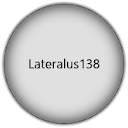

- [About](#about)
  - [Description](#description)
  - [Currently](#currently)
  - [Recently Released](#recently-released)
  - [Myself](#myself)
    - [Vague Statistics](#vague-statistics)
    - [Social Media](#social-media)
      - [Twitter](#twitter)
      - [Facebook](#facebook)
      - [DeviantArt](#deviantart)
      - [Email Me](#email-me)
- [Environments](#environments)
  - [Operating Systems](#operating-systems)
  - [What and Where](#what-and-where)
    - [Languages](#languages)
    - [Environment](#environment)
- [Support Me If You Like](#support-me-if-you-like)
- [Projects](#projects)

---

## About

About this GitHub profile.

### Description

My home of miscellaneous open source programming projects&#46; Here you will find a library of  unorganized and random programs written in various scripting and programming languages for various operating systems&#46;

### Currently

Planning new versions of [***UniShellect***](https://github.com/Lateralus138/UniShellect), [***Bench-CLI***](https://github.com/Lateralus138/bench-cli), and [***YouTube Search Filter***](https://github.com/Lateralus138/YouTubeSearchFilter)&#46; Two of which are scripts that will be re&#45;written in C&#43;&#43;&#46;

### Recently Released

***ColorStatic Bash*** has been re&#45;written in ***C&#43;&#43;*** as the official [***Color Static***](https://www.github.com/Lateralus138/colorstatic)&#46;

[![Color Static (C++ Edition)](https://img.shields.io/endpoint?url=https://raw.githubusercontent.com/Lateralus138/endpoints/master/docs/json/colorstatic.json&logo=data%3Aimage%2Fpng%3Bbase64%2CiVBORw0KGgoAAAANSUhEUgAAABAAAAAQCAMAAAAoLQ9TAAAABGdBTUEAALGPC%2FxhBQAAACBjSFJNAAB6JgAAgIQAAPoAAACA6AAAdTAAAOpgAAA6mAAAF3CculE8AAABcVBMVEUAAAAAgM0Af8wolNQAa7YAbbkAQIcAQIYAVJ0AgM0AgM0AgM0AgM0AgM0AgM0AgM0AgM0AgM0AgM0Af8wAfswAfswAf8wAgM0AgM0AgM0Af80AgM0AgM0AgM0AgM0Af8wAgM0Af80djtIIg84Af8wAfsxYrN4Fg84Gg85RqNwej9MLhM8LhM8AfcsAgM0Hg88AfsshkNNTqd1%2Fv%2BUXi9AHdsAAYKoAY64ih8kAf81YkcEFV54GV55Sj8EnlNULhc8AecYdebwKcrsAe8gAb7oAXacAXqgAcLwAImUAUpoAVJ0AUpwAUZoAIWMAVJ0AVJ0AUpwAUZwAVJ0AVJ0AVJ0AVJ0AgM0cjtJqteGczetqtOEAf807ndjL5fT9%2Fv7%2F%2F%2F%2FM5fQ9ntnu9vu12vCi0Oz%2F%2F%2F6Hw%2Bebzeufz%2Bx%2Bv%2BW12e%2Bgz%2BxqteLu9fmRx%2BjL3Ovu8%2Fi1zeKrzeUAUpw7e7M8fLQAU50cZ6hqm8WcvNgAVJ3xWY3ZAAAAVnRSTlMAAAAAAAAAAAAREApTvrxRCQQ9rfX0qwErleyUKjncOFv%2B%2Fv5b%2Ff7%2B%2Fv7%2B%2Fv1b%2Ff7%2B%2Fv7%2BW%2F7%2B%2Fv79%2Fv7%2B%2Fv7%2B%2Fv7%2B%2Fjfa2jcBKJHqKAEEO6r0CVC8EFaOox4AAAABYktHRF9z0VEtAAAACXBIWXMAAA7DAAAOwwHHb6hkAAAAB3RJTUUH5QYKDQws%2FBWF6QAAAONJREFUGNNjYAABRkZOLkZGBhhgZOTm4eXjF4AJMQoKCYuEhYmKCQmCRBjFJSSlwiMiI6PCpaRlxBkZGGXlomNi4%2BLj4xISo%2BXkgQIKikqx8UnJyUnxKcqKKiAB1ajUJDV1Dc00LW0dXSaggF56fLK%2BgYFhhlGmsQkzRCDL1MzcIhsmYJkTn2tlbWObZ2cP0sKk4OCYH19QWFgQX%2BTkrMLEwOLiWlySD7I2v7TMzZ2Vgc3D08u7vKKysqLc28vHlx3oVg4%2F%2F4DAqqrAAH8%2FDohnODiCgkNCgoM4OOD%2B5eAIDYVyAZ9mMF8DmkLwAAAAJXRFWHRkYXRlOmNyZWF0ZQAyMDIxLTA2LTEwVDE4OjEyOjQ0LTA1OjAwkjvGQgAAACV0RVh0ZGF0ZTptb2RpZnkAMjAyMS0wNi0xMFQxODoxMjo0NC0wNTowMONmfv4AAAAASUVORK5CYII%3D)](https://www.github.com/Lateralus138/colorstatic)

***Netflix Query*** is a command line tool to initiate searching for things on Netlfix in a browser [***Netflix Query***](https://www.github.com/Lateralus138/netflixq)&#46;

[![Netflix Query](https://img.shields.io/endpoint?url=https://raw.githubusercontent.com/Lateralus138/endpoints/master/docs/json/netflixq.json&logo=data%3Aimage%2Fpng%3Bbase64%2CiVBORw0KGgoAAAANSUhEUgAAABAAAAAQCAMAAAAoLQ9TAAAABGdBTUEAALGPC%2FxhBQAAACBjSFJNAAB6JgAAgIQAAPoAAACA6AAAdTAAAOpgAAA6mAAAF3CculE8AAABcVBMVEUAAAAAgM0Af8wolNQAa7YAbbkAQIcAQIYAVJ0AgM0AgM0AgM0AgM0AgM0AgM0AgM0AgM0AgM0AgM0Af8wAfswAfswAf8wAgM0AgM0AgM0Af80AgM0AgM0AgM0AgM0Af8wAgM0Af80djtIIg84Af8wAfsxYrN4Fg84Gg85RqNwej9MLhM8LhM8AfcsAgM0Hg88AfsshkNNTqd1%2Fv%2BUXi9AHdsAAYKoAY64ih8kAf81YkcEFV54GV55Sj8EnlNULhc8AecYdebwKcrsAe8gAb7oAXacAXqgAcLwAImUAUpoAVJ0AUpwAUZoAIWMAVJ0AVJ0AUpwAUZwAVJ0AVJ0AVJ0AVJ0AgM0cjtJqteGczetqtOEAf807ndjL5fT9%2Fv7%2F%2F%2F%2FM5fQ9ntnu9vu12vCi0Oz%2F%2F%2F6Hw%2Bebzeufz%2Bx%2Bv%2BW12e%2Bgz%2BxqteLu9fmRx%2BjL3Ovu8%2Fi1zeKrzeUAUpw7e7M8fLQAU50cZ6hqm8WcvNgAVJ3xWY3ZAAAAVnRSTlMAAAAAAAAAAAAREApTvrxRCQQ9rfX0qwErleyUKjncOFv%2B%2Fv5b%2Ff7%2B%2Fv7%2B%2Fv1b%2Ff7%2B%2Fv7%2BW%2F7%2B%2Fv79%2Fv7%2B%2Fv7%2B%2Fv7%2B%2Fjfa2jcBKJHqKAEEO6r0CVC8EFaOox4AAAABYktHRF9z0VEtAAAACXBIWXMAAA7DAAAOwwHHb6hkAAAAB3RJTUUH5QYKDQws%2FBWF6QAAAONJREFUGNNjYAABRkZOLkZGBhhgZOTm4eXjF4AJMQoKCYuEhYmKCQmCRBjFJSSlwiMiI6PCpaRlxBkZGGXlomNi4%2BLj4xISo%2BXkgQIKikqx8UnJyUnxKcqKKiAB1ajUJDV1Dc00LW0dXSaggF56fLK%2BgYFhhlGmsQkzRCDL1MzcIhsmYJkTn2tlbWObZ2cP0sKk4OCYH19QWFgQX%2BTkrMLEwOLiWlySD7I2v7TMzZ2Vgc3D08u7vKKysqLc28vHlx3oVg4%2F%2F4DAqqrAAH8%2FDohnODiCgkNCgoM4OOD%2B5eAIDYVyAZ9mMF8DmkLwAAAAJXRFWHRkYXRlOmNyZWF0ZQAyMDIxLTA2LTEwVDE4OjEyOjQ0LTA1OjAwkjvGQgAAACV0RVh0ZGF0ZTptb2RpZnkAMjAyMS0wNi0xMFQxODoxMjo0NC0wNTowMONmfv4AAAAASUVORK5CYII%3D)](https://www.github.com/Lateralus138/netflixq)

### Myself

DADDY of twin demon spawn&#33; Older school &#40;25&#43; years&#41; overall com tech &#40;hard &#38; soft&#41; & gamer&#44; Windows&#44; Linux&#44; &#38; even Apple&#46; I guess you could call me a &#34;hobbyist&#34;&#46;

I specialize in the command line and especially automating things&#46; I do these things in both compiled programming languages and scripts with scripting languages in the various environments&#46;

#### Vague Statistics

These are all generaized statistics as monitored by  and .

Time spent in Wakatime monitored environments:

Time spent in  this specific repository:

#### Social Media

You can find me on&#58;

##### Twitter

 

##### Facebook

##### DeviantArt

##### Email Me

---

## Environments

Where and what I do.

### Operating Systems

I primarily work in *Windows* and *Linux*&#44; but some of my code will compile for *MacOS* and occasionally the *Android* command line as well&#46;

### What and Where

This is by far not an exhaustive list of my software nor is it representitive of the quantity and&#x2f;or quality of my overwall work over the years&#x2e; I&#x27;ve been a programmer longer than *FOSS* was a big thing and even then it wasn&#x27;t usual for people to be displaying their code all over the place so I&#x27;ve only been open source less than 2 handfuls of years and even then not all of my work is open source&#x2e;

#### Languages 

I&#39;m more than familiar with many languages and even fluent in a few &#40;though I can admit to getting rusty like all the rest&#41;&#44; but for all intents and purposes the primary languages you will see here are ***AutoHotkey***&#44; ***Shell&#47;BASH***&#44; ***C&#43;&#43;***&#44; and ***Fortran*** &#40;for now&#41;&#46;

#### Environment

The command line&#46;&#46;&#46; mostly&#46;

On occasion you might find a GUI&#46;

- ***Windows***
  - ***CMD***&#44; of course&#46; I started in Windows and way back when I started that's what we had&#46;
  - ***PowerShell***&#44; I &#44; of course&#44; advanced along with Windows&#46; 
- ***Linux***
  - ***Shell***
    - ***Bash***&#44; where I feel at home&#46;
    - ***POSIX*** &#40;fairly&#41;&#44; I can convert most things into POSIX if necessary&#46; Fortunately most Linux environments have Bash.
    - ***Other***&#44; I am somewhat familiar with ***ZSH*** and other shells and can fix most things in those functions&#47;scripts&#46;
- ***Other***&#44; &#40;MacOs included somewhat&#41; 
  - &#34;I get around&#34;&#46;&#46;&#46; It doesn&#39;t matter what operating system I am in, I can do whatever&#44; wherever&#46;

---

## Support Me If You Like

If you like any of the projects below and care to donate to my ***PayPal***:

Or ***Buy Me A Coffee*** if your prefer:

---

## Projects

<!-- This section is:

![Under Construction](https://img.shields.io/static/v1?logo=data:image/png;base64,iVBORw0KGgoAAAANSUhEUgAAAA4AAAAOCAYAAAAfSC3RAAACmElEQVQokUWSa0iTcRTGn//26u4b6ZQ0U8lKMqykwPpgZVBEHyLp8jEoIZJADCQ0iCiStIwuZmHRioIuroQss2VkrkIrdeFckiZqdhctTXPOve8Tr7M6X8/zO+fwPEfIwy7IwQA0GgExGYQwyhCmMLRX1z2hJCJSN+xZgqAZnPgCaAUQ0EHICjSYLlKBCDdNQb7HLmeRoy3zQFnzYk/1WTckGUIXCVD+Kw+BpAxtuBXCpkN7bdXt/JL3W3J3xuHg3iTsL/NkNFWVPoWkQOj/wxooCrRhFgiTjI4n9ZVHHQObjxVEY8UGIi1zEhVFCahwdq5qvn+hHkKC0EcBigxwvAnkW3ge7L6TMi+VztOLOOKOY8ulKL68GM2emnjeLF3AZSlz2FCZ6yaHwLGv6pkv8MyxsUoHLcsLwBuHwE0rtdy2UuLWNTpmpkkszQEfnAPDAd47tbaB7NaJR+eXujfmtGTUXgFWp5uwPd8Oi1GBJEmwWYlP34L4PSFw7chPeD+MYnkWUVmy0CeNfe5N8ANIjNWpNmHzqklYrDIGRwRm2gXsM/xofRMOf1AgcbYOAfgxMvgxCmS9+dbh5A6VarxuIMdBDoJ0g+vSreytNpAEux7qqWrK82I+kC2xYOAzyFbz5QNJPrXhdRo4XK/n3WILkxPsbKqwsr8xBB3PjukhGyJJv+qqB+QvkN0mR2Fim5pU1hobzxTYOPbcyJoTNpoAlu6wdZKvIslR0O9VXe0Clc5p2Ge4WDh36ux3ThM/1RqnNhXvilU32cjvINtAf4cKdkzlSHpBTqgNY11JfLtFA+o14NU8Wx/piggNfg2yGVR8EF9/dP37PyCIoDQLs8z9hmv71nsC4wFz9klX2tD4/AEG+gBoQ7KghD8MZ2xdnt7s7wAAAABJRU5ErkJggg==&label=Under&message=Construction&color=yellow&labelColor=1d1d1d&style=for-the-badge) -->

A few projects you'll find here.

|Letter|Projects|
|:------|:--------|
|A|<table><tr><th>Name</th><th>Description</th><th>Language</th><th>Link</th></tr><tr><td>AutoHotkey Gui Class</td><td style="word-break: break-word;">Create AutoHotkey gui objects with a few options&#46;</td><td>AutoHotkey</td><td></td></tr><tr><td>AutoHotkey Menu Class</td><td style="word-break: break-word;">Create objects of system tray/context menus in the AutoHotkey scripting language&#46;</td><td>AutoHotkey</td><td></td></tr></table>|
|B|<table><tr><th>Name</th><th>Description</th><th>Language</th><th>Link</th></tr><tr><td>Bench CLI</td><td style="word-break: break-word;">Cross-platform command line tool to benchmark commands and other executables/scripts in command lines written in `Fortran`&#46; Very precise and fast&#46;</td><td>Fortran</td><td></td></tr><tr><td>Black Hosts</td><td style="word-break: break-word;">This is a cross-platform hosts file installer for hosts files found at the StevenBlack repository&#46;</td><td>Rust</td><td></td></tr></table>|
|C|<table><tr><th>Name</th><th>Description</th><th>Language</th><th>Link</th></tr><tr><td>Cleantemp</td><td style="word-break: break-word;">Clean temporary files and directories in Windows&#46;</td><td>C&#43;&#43;</td><td></td></tr><tr><td>ColorStatic CPP</td><td style="word-break: break-word;">C++ version of Color Static&#46;</td><td>C++</td><td></td></tr><tr><td>ColorStatic Bash</td><td style="word-break: break-word;">Fun Bash hybrid function/script to generate a random colorful "Static" /"Matrix" (like?) style animation in a Linux (or any *nix?) command line&#46;</td><td>Bash</td><td></td></tr><tr><td>Console Palette</td><td style="word-break: break-word;">Display the 4bit colors of the current console&#46;</td><td>C&#43;&#43;</td><td></td></tr><tr><td>Contains</td><td style="word-break: break-word;">Check if a hay[stack] contains a [needle] in the command line with some options&#46;</td><td>C&#43;&#43;</td><td></td></tr><tr><td>CPL Explorer</td><td style="word-break: break-word;">View info and/or run CPL files&#46;</td><td>AutoHotkey</td><td></td></tr><tr><td>CDTD Windows</td><td style="word-break: break-word;">Change a console's title to the current time and date on a loop&#46; Windows version&#46;</td><td>C&#43;&#43;</td><td></td></tr></table>|
|D|<table><tr><th>Name</th><th>Description</th><th>Language</th><th>Link</th></tr><tr><td>Desktop Gen</td><td style="word-break: break-word;">Generate Linux .desktop shortcut files from the command line&#46;</td><td>C&#43;&#43;</td><td></td></tr></table>|
|E|<table><tr><th>Name</th><th>Description</th><th>Language</th><th>Link</th></tr><tr><td>Empty Bins</td><td style="word-break: break-word;">Command line utility that scans all fixed partitions and empty any populated Recycle Bins ($Recycle.Bin). Options (as passed parameters) to show info traytips and set traytip's time&#46;</td><td>AutoHotkey</td><td></td></tr></table>|
|F|<table><tr><th>Name</th><th>Description</th><th>Language</th><th>Link</th></tr><tr><td>FluxClip</td><td style="word-break: break-word;">Screenshot utility for Windows&#46;</td><td>AutoHotkey</td><td></td></tr></table>|
|G|<table><tr><th>Name</th><th>Description</th><th>Language</th><th>Link</th></tr><tr><td>GunMetal Plank Theme</td><td style="word-break: break-word;">Just a little Gun Metal Blue & Gray theme for the Plank dock&#46;</td><td>Plank Config</td><td></td></tr></table>|
|H|<table><tr><th>Name</th><th>Description</th><th>Language</th><th>Link</th></tr><tr><td>HyperCLIW</td><td style="word-break: break-word;">Just a little Gun Metal Blue & Gray theme for the Plank dock&#46;</td><td>C&#43;&#43;</td><td></td></tr></table>|
|I||
|J||
|K|<table><tr><th>Name</th><th>Description</th><th>Language</th><th>Link</th></tr><tr><td>Key Scan Code</td><td style="word-break: break-word;">View scan and virtual key codes in Windows&#46;</td><td>AutoHotkey</td><td></td></tr></table>|
|L||
|M|<table><tr><th>Name</th><th>Description</th><th>Language</th><th>Link</th></tr><tr><td>MC Chunk Get</td><td style="word-break: break-word;">Get coordinate boundaries of a chunk by providing any x, z coordinates inside of that chunk in Minecraft&#46;</td><td>AutoHotkey</td><td></td></tr><tr><td>MC Chunk Get V2</td><td style="word-break: break-word;">Get chunk boundaries in Minecraft by providing x, z coordinates in that chunk. This is a Python rewrite of my AutoHotkey program&#46;</td><td>Python</td><td></td></tr><tr><td>MC Chunk Get V3</td><td style="word-break: break-word;">This is a tool that calculates the chunk boundary coordinates of a chunk by providing a pair of X,Z coordinates within that chunk in Minecraft&#46;</td><td>Rust</td><td></td></tr><tr><td>MSC Explorer</td><td style="word-break: break-word;">View and/or run MSC files for the Microsoft Management Console (mmc.exe)View and/or run MSC files for the Microsoft Management Console (mmc.exe)&#46;</td><td>AutoHotkey</td><td></td></tr></table>|
|N|<table><tr><th>Name</th><th>Description</th><th>Language</th><th>Link</th></tr><tr><td>NPS CRC Check</td><td style="word-break: break-word;">Get or check a files CRC&#46;</td><td>AutoHotkey</td><td></td></tr><tr><td>Netflix Query</td><td style="word-break: break-word;">Load Netflix in a browser with search options&#46;</td><td>C++</td><td></td></tr></table>|
|O|<table><tr><th>Name</th><th>Description</th><th>Language</th><th>Link</th></tr><tr><td>On The Fly DPI</td><td style="word-break: break-word;">Change the mouse sensitivity quickly with the keyboard and mouse&#46;</td><td>AutoHotkey</td><td></td></tr><tr><td>OnlyOne</td><td style="word-break: break-word;">Print unique lines from a file&#46;</td><td>Rust</td><td></td></tr><tr><td>OnlyOne V2</td><td style="word-break: break-word;">Get unique lines from a file, piped stdin, or passed arguments in the command line&#46;</td><td>C&#43;&#43;</td><td></td></tr></table>|
|P|<table><tr><th>Name</th><th>Description</th><th>Language</th><th>Link</th></tr><tr><td>Procspin</td><td style="word-break: break-word;">Linux Bash command line utility to create a process/progress animation with text and custom frame animations for silently running PIDs&#46;</td><td>Bash</td><td></td></tr></table>|
|Q||
|R|<table><tr><th>Name</th><th>Description</th><th>Language</th><th>Link</th></tr><tr><td>RGBTOHEXR</td><td style="word-break: break-word;">Get or check a files CRC&#46;</td><td>AutoHotkey</td><td></td></tr><tr><td>RW Mode</td><td style="word-break: break-word;">Read, toggle, or set a file's Read /Write mode in Windows&#46;</td><td>C&#43;&#43;</td><td></td></tr></table>|
|S|<table><tr><th>Name</th><th>Description</th><th>Language</th><th>Link</th></tr><tr><td>Set Colors</td><td style="word-break: break-word;">Another way to set colors in Linux shells&#46;</td><td>Rust</td><td></td></tr><tr><td>StrLen</td><td style="word-break: break-word;">Get the character length of a string from the command line&#46;</td><td>C&#43;&#43;</td><td></td></tr></table>|
|T|<table><tr><th>Name</th><th>Description</th><th>Language</th><th>Link</th></tr><tr><td>Task Lister</td><td style="word-break: break-word;">Task Lister is a portable task manager that can be used as a alternative to the native Windows Task Manager. It is great for flash drives or disk to use on computers that have viruses that have disabled the task manager or it can be used as a lightweight alternative&#46;</td><td>AutoHotkey</td><td></td></tr><tr><td>Todo Bash</td><td style="word-break: break-word;">Todo list for the Bash command line&#46;</td><td>Bash</td><td></td></tr><tr><td>TTS WavGen</td><td style="word-break: break-word;">Text To Speech wav generator written in AutoHotkey and uses VBScript&#46;</td><td>AutoHotkey</td><td></td></tr></table>|
|U|<table><tr><th>Name</th><th>Description</th><th>Language</th><th>Link</th></tr><tr><td>UniShellect</td><td style="word-break: break-word;">This tool parses a JSON config file and loads a highly customizable menu of shells, interpreters, files, commands and possible arguments into any command line interface. This is inspired by the &#34;hyper-shellect&#34; plug-in for the &#34;Hyper&#34; terminal&#46;</td><td>Fortran</td><td></td></tr><tr><td>UniSym Send</td><td style="word-break: break-word;">Unicode character, symbol, and emoji utility for Windows written in AutoHotkey&#46;</td><td>AutoHotkey</td><td></td></tr></table>|
|V|<table><tr><th>Name</th><th>Description</th><th>Language</th><th>Link</th></tr><tr><td>Volume RevolverV2</td><td style="word-break: break-word;">Quickly change the system volume with the mouse wheel and modifier keys&#46;</td><td>AutoHotkey</td><td></td></tr></table>|
|W||
|X||
|Y|<table><tr><th>Name</th><th>Description</th><th>Language</th><th>Link</th></tr><tr><td>You Tube Search Filter</td><td style="word-break: break-word;">About Do YouTube searches with (or without) a pre-filter from the Linux Bash command line since we can't do them at YouTube ourselves&#46;</td><td>Bash</td><td></td></tr></table>|
|Z||

---

This profile last updated

Last Commit:

Services hosting this page

 
